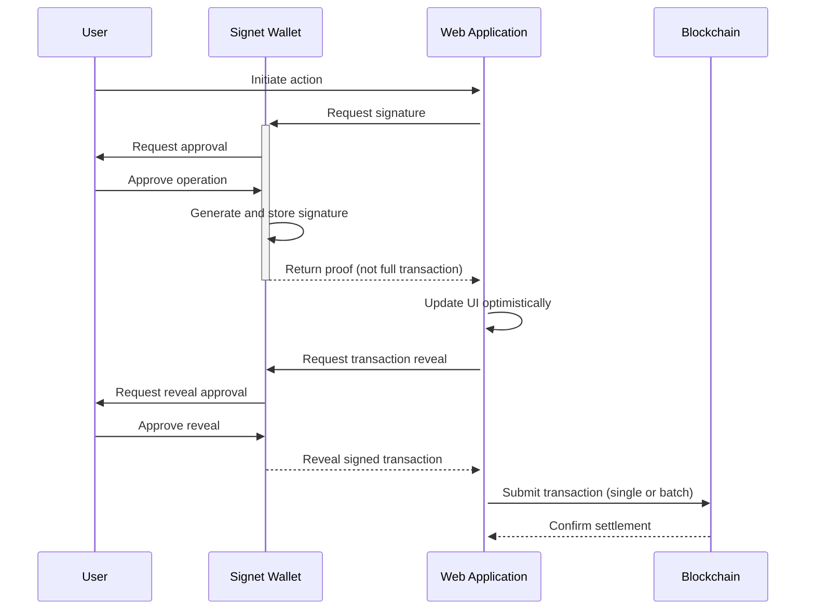

  <picture>
    <source media="(prefers-color-scheme: dark)" srcset="./assets/signet-logo-light.png">
    
  </picture>
   

  <h1>
    Signet Signer
  </h1>  
  

## Introduction

Signet is a comprehensive infrastructure for blockchain interaction that bridges web applications and decentralized protocols. It consists of two main components:

1. **Signet Wallet Extension**: A browser extension that enables users to securely create and manage blockchain identities, sign transactions, and control when and how their signed transactions are revealed to applications.

2. **Signet SDK**: A developer toolkit that allows web applications to seamlessly communicate with the Signet Wallet, request signatures, and manage transaction lifecycles.

Signet serves as the foundational user-facing component of the Blaze Protocol, making blockchain interactions as seamless as traditional web experiences.

## Key Features

### For Users

- **Two-Phase Transaction Authorization**: Sign operations and control when they are revealed to applications
- **Private Transaction Storage**: Store signed transactions privately until you decide to reveal them
- **Intuitive Permission System**: Fine-grained control over what applications can do with your identity
- **Transaction Batching**: Combine multiple actions into efficient batches for cost savings
- **Web2-Like Experience**: No cryptic confirmation modals or technical jargon

### For Developers

- **Simple Integration**: Add blockchain capabilities to any web application with minimal code
- **Optimistic UI Support**: Update interfaces immediately while transactions are pending
- **Transaction Management**: Control when and how to submit batched transactions
- **Flexible Authentication**: Use for identity and authentication without transaction overhead
- **Comprehensive TypeScript SDK**: Type-safe integration with your application

## Architecture

Signet implements a multi-layered architecture that separates transaction signing from settlement:

