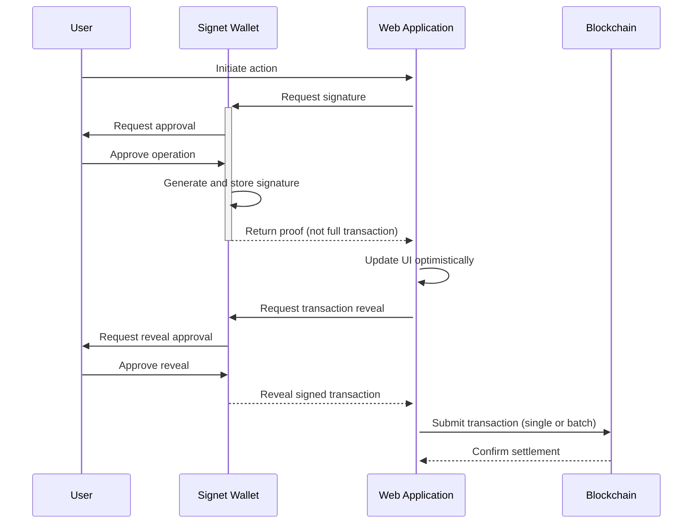

<p align="center">
  <picture>
    <source media="(prefers-color-scheme: dark)" srcset="./assets/signet-logo-light.png">
    
  </picture>
  <br />
</p>
<div align="center">
  <h1>
    Signet: The Missing Link for Web3 UX
  </h1>  
  <a href="https://github.com/r0zar/signet">
    
  </a>
  <a href="https://discord.gg/r0zar">
    
  </a>
  <a href="https://twitter.com/signetwallet">
    
  </a> 
  <br />
  <br />
  
</div>

## Introduction

Signet is a comprehensive infrastructure for blockchain interaction that bridges web applications and decentralized protocols. It consists of two main components:

1. **Signet Wallet Extension**: A browser extension that enables users to securely create and manage blockchain identities, sign transactions, and control when and how their signed transactions are revealed to applications.

2. **Signet SDK**: A developer toolkit that allows web applications to seamlessly communicate with the Signet Wallet, request signatures, and manage transaction lifecycles.

Signet serves as the foundational user-facing component of the Blaze Protocol, making blockchain interactions as seamless as traditional web experiences.

## Key Features

### For Users

- **Two-Phase Transaction Authorization**: Sign operations and control when they are revealed to applications
- **Private Transaction Storage**: Store signed transactions privately until you decide to reveal them
- **Intuitive Permission System**: Fine-grained control over what applications can do with your identity
- **Multi-Chain Support**: Manage identities across multiple blockchains in one interface
- **Transaction Batching**: Combine multiple actions into efficient batches for cost savings
- **Web2-Like Experience**: No cryptic confirmation modals or technical jargon

### For Developers

- **Simple Integration**: Add blockchain capabilities to any web application with minimal code
- **Optimistic UI Support**: Update interfaces immediately while transactions are pending
- **Transaction Management**: Control when and how to submit batched transactions
- **Flexible Authentication**: Use for identity and authentication without transaction overhead
- **Comprehensive TypeScript SDK**: Type-safe integration with your application
- **Zero-Dependency Core**: Lightweight integration options

## Architecture

Signet implements a multi-layered architecture that separates transaction signing from settlement:



## Getting Started

### For Users

1. Install the Signet Wallet extension from the [Chrome Web Store](https://chrome.google.com/webstore/detail/signet-wallet/signet-wallet-extension)
2. Create or import your identity
3. Start using Signet-compatible applications with a seamless experience

### For Developers

1. Install the Signet SDK:
```bash
npm install signet-sdk
# or
yarn add signet-sdk
# or
pnpm add signet-sdk
```

2. Initialize the SDK in your application:
```typescript
import { Signet } from 'signet-sdk';

const signet = new Signet({
  appName: 'Your Application Name',
  network: 'mainnet', // or 'testnet'
});

// Check if Signet wallet is installed
const isInstalled = await signet.isInstalled();
if (!isInstalled) {
  // Prompt user to install Signet
}

// Request a signature
const result = await signet.requestSignature({
  operation: 'transfer',
  recipient: 'RECIPIENT_ADDRESS',
  amount: 100,
});

// Update UI optimistically
updateUI(result.proof);

// When ready to settle, request the full transaction
const transaction = await signet.revealTransaction(result.proofId);

// Submit the transaction
const txResult = await signet.submitTransaction(transaction);
```

## Development Setup

To work on Signet locally:

```bash
# Clone the repository
git clone https://github.com/charisma-labs/signet.git
cd signet

# Install dependencies
pnpm install

# Start the development server
pnpm dev

# Build the extension and SDK
pnpm build
```

To install the development version of the extension:

1. Go to `chrome://extensions/` in Chrome
2. Enable Developer Mode
3. Click "Load unpacked"
4. Select the `dist/extension` directory

## Use Cases

Signet powers a variety of applications in the Blaze ecosystem:

- **OP_PREDICT**: A prediction market platform with instant UI feedback
- **Token Transfer Applications**: Fast and efficient token movements
- **NFT Marketplaces**: Seamless bidding and purchasing experiences
- **DAOs**: Frictionless governance and voting
- **DeFi Applications**: Trading, swapping, and liquidity provision without delays

## Documentation

For complete documentation, visit our [developer docs](https://docs.signet.wallet).

## Contributing

Contributions are welcome! Check out our [Contributing Guide](./CONTRIBUTING.md) to get started.

## Community

- [Discord](https://discord.gg/charisma-labs) - Join our developer community
- [Twitter](https://twitter.com/signetwallet) - Follow for updates
- [GitHub Discussions](https://github.com/charisma-labs/signet/discussions) - For questions and support

## License

Signet is [MIT licensed](./LICENSE).
